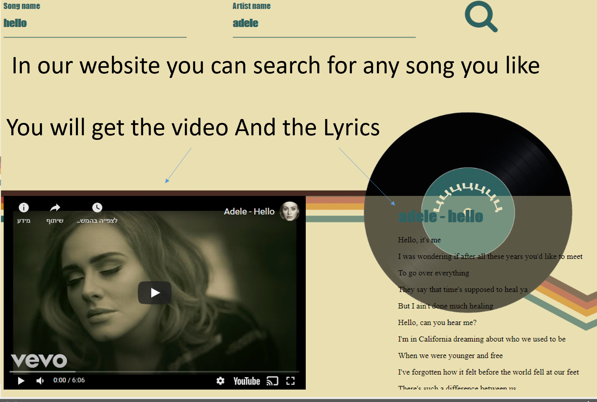
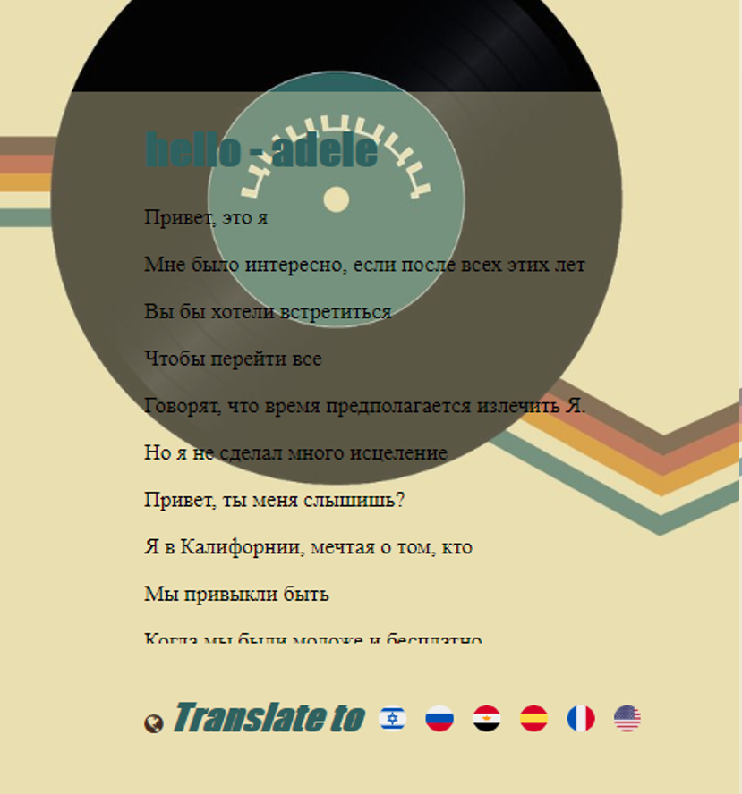
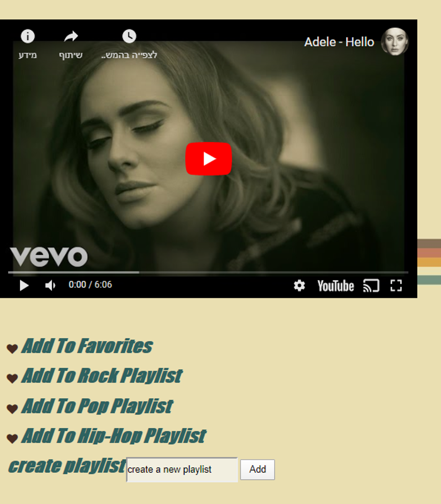
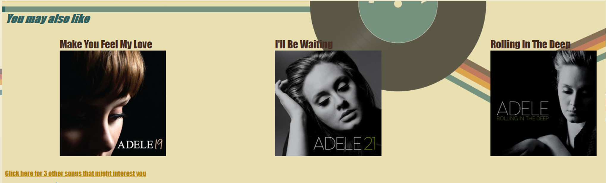

# MusInfo
Web-app that allows users to search in one place by name of singer and songs name video, lyrics (include translation) and recommendation

## Screenshots and Features

### Search
In our website you can search for any song you like
You will get the video And the Lyrics

### Translate
You can translate
the lyrics to:
Hebrew
Russian
Arabic
Spanish
France
English

### Playlists
Make your own playlists with your favorite songs!!!
You can also choose which playlist by music type
AND CREATE YOUR OWN TYPE OF PLAYLIST

Just click on the little heart and – WA – LA!

### Recommendations 
Our app will also suggest you similar songs you may be like by a very sophisticated algorithm….

You can click here get a few more suggestions if you like (:

